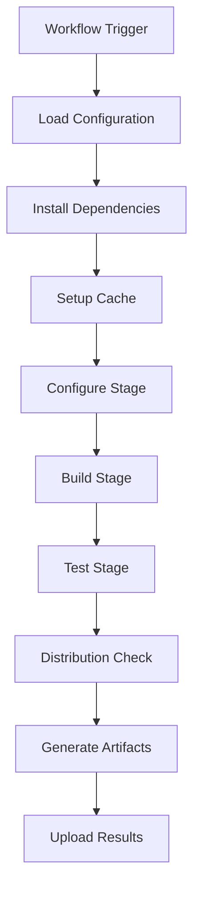

# 🔨 Makefile Build System Documentation

Complete documentation for the professional Makefile build system supporting autotools, CMake, kernel modules, and custom build processes.

## 🎯 Overview

The Makefile build system provides enterprise-grade automation for C/C++ projects using various build systems. It supports traditional Makefiles, GNU autotools, CMake with Makefile generators, and Linux kernel modules.

### Key Features

- **🔧 Multi-Build System Support**: Autotools, CMake, basic Makefiles, kernel modules
- **⚙️ Flexible Configuration**: YAML-based configuration system
- **🚀 Performance Optimization**: Parallel builds and intelligent caching
- **🧪 Comprehensive Testing**: Multiple test targets and quality reporting
- **📦 Distribution Management**: Built-in distcheck and packaging
- **🌐 Cross-Platform Support**: Linux, macOS with matrix builds
- **🛡️ Security Integration**: Built-in security scanning capabilities

## 🏗️ Architecture



### Components

| Component | Purpose | Location |
|-----------|---------|----------|
| **Composite Action** | Core build logic | `.github/actions/makefile-build/` |
| **Reusable Workflow** | Complete CI/CD pipeline | `.github/workflows/makefile-build.yml` |
| **Configurations** | Build system templates | `.github/config/makefile-build/` |
| **Examples** | Usage demonstrations | `github/workflows/examples/makefile-build/` |

## 🚀 Getting Started

### 1. Choose Your Build System

Identify your project's build system:

| Build System | Indicators | Configuration |
|--------------|------------|---------------|
| **GNU Autotools** | `configure.ac`, `Makefile.am` | `autotools` |
| **CMake Makefiles** | `CMakeLists.txt` | `cmake-makefile` |
| **Kernel Module** | Kernel source, `Kbuild` | `kernel-module` |
| **Basic Makefile** | `Makefile` only | `default` |

### 2. Basic Setup

Create `.github/workflows/build.yml`:

```yaml
name: 🔨 Build & Test

on: [push, pull_request]

jobs:
  build:
    uses: bauer-group/automation-templates/.github/workflows/makefile-build.yml@main
    with:
      config-file: 'autotools'  # Choose your config
      make-targets: 'all'
      check-targets: 'check'
      distcheck-enabled: true
```

### 3. Configuration Customization

Create a custom configuration in `.github/config/makefile-build/my-project.yml`:

```yaml
name: "My Project Build"
description: "Custom configuration for my specific project"

# Configure stage settings
configure:
  script: "./configure"
  args: ["--enable-feature", "--with-library=/usr/local"]
  cache_enabled: true

# Build stage settings  
build:
  targets: ["all", "docs"]
  parallel_jobs: "auto"
  fail_on_warnings: false
  
  env:
    CFLAGS: "-O2 -g -Wall -Wextra"
    CXXFLAGS: "-O2 -g -Wall -Wextra"

# Test stage settings
test:
  enabled: true
  targets: ["check", "unit-test", "integration-test"]
  parallel: true
  continue_on_error: false
```

## 📋 Configuration Reference

### Core Configuration Structure

```yaml
# Metadata
name: "Configuration Name"
description: "Description of this configuration"

# Build Environment
environment:
  dependencies:
    ubuntu: ["build-essential", "autoconf"]
    fedora: ["@development-tools", "autoconf"]
    macos: ["autoconf", "automake"]

# Configure Stage
configure:
  script: "./configure"           # Configure script path
  args: []                       # Additional arguments
  generate_if_missing: true     # Auto-generate if missing
  cache_enabled: true           # Enable configure caching

# Build Stage
build:
  targets: ["all"]              # Make targets to build
  parallel_jobs: "auto"         # Parallel compilation
  make_args: []                 # Additional make arguments
  fail_on_warnings: false       # Treat warnings as errors
  
  env:                          # Build environment variables
    CFLAGS: "-O2 -g"
    CXXFLAGS: "-O2 -g"

# Test Stage
test:
  enabled: true                 # Enable testing
  targets: ["check"]            # Test targets
  parallel: true               # Parallel test execution
  continue_on_error: false     # Continue on test failures

# Distribution Check
distcheck:
  enabled: true                # Enable distcheck
  target: "distcheck"          # Distcheck target name
  timeout_minutes: 30          # Distcheck timeout

# Artifacts Configuration
artifacts:
  enabled: true                # Generate artifacts
  paths:                       # Artifact paths to collect
    - "config.log"
    - "**/*.log"
  
  test_results:               # Test result paths
    - "test-*.log"
    - "**/*.tap"

# Caching Configuration
cache:
  enabled: true               # Enable caching
  paths:                      # Paths to cache
    - "~/.cache/"
    - ".deps/"
  
  key_files:                  # Files that affect cache key
    - "configure.ac"
    - "Makefile.am"
```

### Available Configurations

#### Default Configuration (`default.yml`)

Basic configuration for standard make projects:

```yaml
configure:
  script: "./configure"
  args: []

build:
  targets: ["all"]
  parallel_jobs: "auto"

test:
  targets: ["check"]
  
distcheck:
  enabled: true
```

**Best for:** Simple C/C++ projects with basic Makefiles

#### Autotools Configuration (`autotools.yml`)

Optimized for GNU autotools projects:

```yaml
configure:
  script: "./configure"
  args: ["--enable-shared", "--enable-static", "--with-pic"]
  generate_if_missing: true
  autoreconf_args: ["-fiv", "--install"]

build:
  targets: ["all"]
  env:
    CFLAGS: "-O2 -g -Wall"

test:
  targets: ["check", "installcheck"]

distcheck:
  enabled: true
  timeout_minutes: 45
```

**Best for:** Projects using autoconf, automake, libtool

#### CMake Makefile Configuration (`cmake-makefile.yml`)

For CMake projects using Makefile generator:

```yaml
configure:
  script: "cmake"
  args: ["-S", ".", "-B", "build", "-DCMAKE_BUILD_TYPE=Release"]

build:
  use_cmake_build: true
  cmake_build_args: ["--build", "build", "--parallel"]

test:
  use_ctest: true
  ctest_args: ["--test-dir", "build", "--parallel", "auto"]
```

**Best for:** CMake-based projects generating Makefiles

#### Kernel Module Configuration (`kernel-module.yml`)

Specialized for Linux kernel module development:

```yaml
environment:
  dependencies:
    ubuntu: ["linux-headers-generic", "build-essential"]

build:
  targets: ["modules"]
  make_args: ["KDIR=/lib/modules/$(shell uname -r)/build"]

test:
  targets: ["modules_check"]
  custom_commands: ["modinfo *.ko"]

distcheck:
  enabled: false  # Not applicable for kernel modules
```

**Best for:** Linux kernel module development

#### Matrix Configuration (`matrix.yml`)

Multi-platform testing configuration:

```yaml
environment:
  matrix:
    os: ["ubuntu-latest", "macos-latest"]
    compiler: ["gcc", "clang"]

strategy:
  fail_fast: false
  max_parallel: 6
```

**Best for:** Cross-platform projects requiring extensive testing

## 🔧 Build Systems Guide

### GNU Autotools Projects

Autotools projects use autoconf, automake, and libtool for build configuration.

**Project Structure:**
```
project/
├── configure.ac          # Autoconf configuration
├── Makefile.am          # Automake configuration  
├── src/
│   ├── Makefile.am
│   └── main.c
└── tests/
    ├── Makefile.am
    └── test_main.c
```

**Workflow Configuration:**
```yaml
jobs:
  build:
    uses: bauer-group/automation-templates/.github/workflows/makefile-build.yml@main
    with:
      config-file: 'autotools'
      configure-args: '--enable-shared --disable-static'
      make-targets: 'all'
      check-targets: 'check installcheck'
      distcheck-enabled: true
```

**Advanced Features:**
- Automatic `autoreconf` execution
- Configure script caching
- Distribution package creation
- Installation testing

### CMake with Makefile Generator

CMake projects can generate Makefiles for build execution.

**Project Structure:**
```
project/
├── CMakeLists.txt       # CMake configuration
├── src/
│   ├── CMakeLists.txt
│   └── main.cpp
└── tests/
    ├── CMakeLists.txt
    └── test_main.cpp
```

**Workflow Configuration:**
```yaml
jobs:
  build:
    uses: bauer-group/automation-templates/.github/workflows/makefile-build.yml@main
    with:
      config-file: 'cmake-makefile'
      configure-script: 'cmake'
      configure-args: '-S . -B build -DCMAKE_BUILD_TYPE=Release'
      working-directory: 'build'
      make-targets: 'all'
      check-targets: 'test'
```

**Advanced Features:**
- Out-of-source builds
- CTest integration
- Package generation
- Cross-platform builds

### Linux Kernel Modules

Kernel modules require special build procedures and dependencies.

**Project Structure:**
```
module/
├── Kbuild               # Kernel build configuration
├── Makefile            # Module Makefile
├── module.c            # Module source
└── module.h            # Module headers
```

**Workflow Configuration:**
```yaml
jobs:
  build:
    uses: bauer-group/automation-templates/.github/workflows/makefile-build.yml@main
    with:
      config-file: 'kernel-module'
      make-targets: 'modules'
      check-targets: 'modules_check'
      distcheck-enabled: false
      runs-on: 'ubuntu-latest'  # Linux only
```

**Advanced Features:**
- Kernel header dependencies
- Module signature checking
- Static analysis with sparse
- Coding style validation

### Basic Makefiles

Simple projects with handwritten Makefiles.

**Project Structure:**
```
project/
├── Makefile            # Build configuration
├── src/
│   └── main.c
└── tests/
    └── test.c
```

**Workflow Configuration:**
```yaml
jobs:
  build:
    uses: bauer-group/automation-templates/.github/workflows/makefile-build.yml@main
    with:
      config-file: 'default'
      configure-script: ''  # No configure step
      make-targets: 'all install'
      check-targets: 'test'
```

## 🌐 Multi-Platform Builds

### Cross-Platform Strategy

Use matrix builds for comprehensive platform testing:

```yaml
name: 🌐 Multi-Platform Build

jobs:
  build:
    strategy:
      matrix:
        os: [ubuntu-latest, ubuntu-20.04, macos-latest]
        compiler: [gcc, clang]
        include:
          - os: ubuntu-latest
            cc: gcc
            cxx: g++
          - os: ubuntu-latest
            cc: clang
            cxx: clang++
          - os: macos-latest
            cc: clang
            cxx: clang++
    
    runs-on: ${{ matrix.os }}
    
    steps:
      - uses: actions/checkout@v4
      
      - name: Setup Compiler
        run: |
          echo "CC=${{ matrix.cc }}" >> $GITHUB_ENV
          echo "CXX=${{ matrix.cxx }}" >> $GITHUB_ENV
      
      - uses: bauer-group/automation-templates/.github/actions/makefile-build@main
        with:
          config-file: 'matrix'
          parallel-jobs: 'auto'
```

### Platform-Specific Configurations

Handle platform differences in configurations:

```yaml
# Platform-specific dependencies
environment:
  dependencies:
    ubuntu:
      - build-essential
      - pkg-config
    
    fedora:
      - "@development-tools"
      - pkgconfig
    
    macos:
      - autoconf
      - pkg-config

# Platform-specific configure args
configure:
  platform_args:
    linux:
      - "--enable-linux-specific"
    
    macos:
      - "--enable-macos-specific"
```

### Architecture Support

Build for multiple architectures:

```yaml
jobs:
  architecture-build:
    strategy:
      matrix:
        arch: [amd64, arm64, armv7]
    
    runs-on: ubuntu-latest
    
    steps:
      - uses: docker/setup-qemu-action@v3
        with:
          platforms: linux/${{ matrix.arch }}
      
      - name: Cross-Platform Build
        run: |
          docker run --platform=linux/${{ matrix.arch }} \
            -v $PWD:/src ubuntu:latest \
            bash -c "cd /src && make all"
```

## ⚡ Performance Optimization

### Parallel Compilation

Optimize build performance with parallel compilation:

```yaml
with:
  parallel-jobs: 'auto'  # Use all available cores
  
# Or specify exact number:
with:
  parallel-jobs: '4'
```

### Build Caching

Enable intelligent caching for faster builds:

```yaml
with:
  cache-enabled: true
  config-file: 'autotools'  # Includes cache configuration
```

**Cached Items:**
- Configure cache files (`config.cache`)
- Dependency metadata (`.deps/`)
- Autotools cache (`autom4te.cache/`)
- Build intermediates

### Incremental Builds

Configure for optimal incremental builds:

```yaml
cache:
  enabled: true
  paths:
    - "~/.cache/"
    - ".deps/"
    - "config.cache"
    - "autom4te.cache/"
  
  key_files:
    - "configure.ac"
    - "Makefile.am"
    - "**/*.c"
    - "**/*.h"
```

## 🔍 Quality Assurance

### Static Analysis Integration

Integrate static analysis tools:

```yaml
quality:
  static_analysis: true
  static_tools:
    - "cppcheck"
    - "clang-tidy"
    - "scan-build"

# Enable in workflow
with:
  fail-on-warnings: true
  generate-reports: true
```

### Code Coverage

Enable code coverage collection:

```yaml
# In configuration
quality:
  code_coverage: true
  coverage_tools:
    - "gcov"
    - "lcov"

# Build with coverage
env:
  CFLAGS: "-O0 -g --coverage"
  CXXFLAGS: "-O0 -g --coverage"
```

### Security Hardening

Apply security hardening flags:

```yaml
# In configuration
build:
  env:
    CFLAGS: "-O2 -g -Wall -Wextra -fstack-protector-strong -D_FORTIFY_SOURCE=2"
    CXXFLAGS: "-O2 -g -Wall -Wextra -fstack-protector-strong -D_FORTIFY_SOURCE=2"
    LDFLAGS: "-Wl,-z,relro,-z,now"

# In workflow
with:
  security-scan: true
  fail-on-warnings: true
```

## 📊 Reporting and Artifacts

### Build Artifacts

The system generates comprehensive build artifacts:

```
build-artifacts/
├── build-summary.txt        # Build overview
├── config.log              # Configure output
├── config.status           # Configure state
├── Makefile.generated      # Generated Makefile
├── test-*.log              # Test results
├── *.tap                   # TAP test format
└── *.xml                   # JUnit test format
```

### Custom Artifact Collection

Configure custom artifact collection:

```yaml
artifacts:
  enabled: true
  paths:
    - "doc/"              # Documentation
    - "*.tar.gz"          # Distribution packages
    - "coverage/"         # Coverage reports
  
  test_results:
    - "test-results.xml"
    - "coverage.xml"
    - "**/*.tap"
```

### Report Generation

Enable comprehensive reporting:

```yaml
with:
  generate-reports: true
  upload-artifacts: true

# Access artifacts in subsequent steps
- name: Download Artifacts
  uses: actions/download-artifact@v4
  with:
    name: makefile-build-artifacts-${{ github.run_number }}
```

## 🛡️ Security Integration

### Pre-build Security Scanning

Integrate security scanning before builds:

```yaml
jobs:
  security:
    runs-on: ubuntu-latest
    steps:
      - uses: actions/checkout@v4
      - uses: bauer-group/automation-templates/.github/actions/gitleaks-scan@main
  
  build:
    needs: security
    uses: bauer-group/automation-templates/.github/workflows/makefile-build.yml@main
    with:
      security-scan: true
```

### Binary Security Analysis

Analyze built binaries for security features:

```yaml
- name: Security Analysis
  run: |
    # Check security features
    checksec --file=./my-binary
    
    # Analyze ELF headers
    readelf -d ./my-binary | grep -E "(RELRO|BIND_NOW)"
    
    # Check for dangerous functions
    strings ./my-binary | grep -E "(strcpy|sprintf|gets)" || echo "Safe"
```

### Dependency Vulnerability Scanning

Scan dependencies for known vulnerabilities:

```yaml
- name: Dependency Scan
  run: |
    # System package scan
    debsecan --suite $(lsb_release -cs)
    
    # Library analysis
    ldd ./my-binary | while read lib; do
      echo "Checking: $lib"
    done
```

## 🐞 Troubleshooting

### Common Issues and Solutions

#### Configure Script Issues

**Problem:** Configure script not found or fails
```
Error: ./configure: No such file or directory
```

**Solution:**
```yaml
with:
  configure-script: 'autoreconf -fiv && ./configure'
  # Or use autotools configuration:
  config-file: 'autotools'  # Includes autoreconf
```

#### Missing Dependencies

**Problem:** Build fails due to missing libraries
```
Error: Package 'libssl' was not found
```

**Solution:**
```yaml
with:
  install-dependencies: true
  config-file: 'autotools'  # Includes common dependencies

# Or customize dependencies
# In .github/config/makefile-build/my-config.yml:
environment:
  dependencies:
    ubuntu: ["libssl-dev", "libcurl4-openssl-dev"]
```

#### Parallel Build Failures

**Problem:** Race conditions in parallel builds
```
Error: make[1]: *** [target] Error 2
```

**Solution:**
```yaml
with:
  parallel-jobs: '1'  # Disable parallel builds temporarily
  # Or fix Makefile dependencies and re-enable
```

#### Test Failures

**Problem:** Tests fail but build succeeds
```
Error: 2 of 10 tests failed
```

**Solution:**
```yaml
with:
  check-targets: 'check || true'  # Continue on test failure
  generate-reports: true          # Generate detailed logs
```

### Debug Techniques

#### Enable Verbose Output

```yaml
with:
  generate-reports: true
env:
  VERBOSE: '1'
  MAKEFLAGS: '-d'           # Make debug mode
  V: '1'                    # Autotools verbose mode
```

#### Custom Debug Configuration

```yaml
# .github/config/makefile-build/debug.yml
build:
  env:
    CFLAGS: "-O0 -g3 -DDEBUG -Wall -Wextra"
    CXXFLAGS: "-O0 -g3 -DDEBUG -Wall -Wextra"
  
  make_args: ["VERBOSE=1"]

test:
  env:
    VERBOSE: "1"
    DEBUG: "1"
```

#### Log Analysis

Key logs to examine:
- `config.log` - Configure stage issues
- `build.log` - Compilation problems  
- `test-*.log` - Test execution details
- `distcheck.log` - Distribution check problems

## 🔗 Integration Patterns

### With Documentation Generation

```yaml
jobs:
  build:
    uses: bauer-group/automation-templates/.github/workflows/makefile-build.yml@main
    with:
      make-targets: 'all doc'
      config-file: 'autotools'
  
  deploy-docs:
    needs: build
    runs-on: ubuntu-latest
    steps:
      - uses: actions/checkout@v4
      - name: Deploy Documentation
        uses: peaceiris/actions-gh-pages@v3
        with:
          github_token: ${{ secrets.GITHUB_TOKEN }}
          publish_dir: ./doc/html
```

### With Package Publishing

```yaml
jobs:
  build:
    uses: bauer-group/automation-templates/.github/workflows/makefile-build.yml@main
    with:
      make-targets: 'dist'
      distcheck-enabled: true
  
  publish:
    needs: build
    if: github.event_name == 'release'
    runs-on: ubuntu-latest
    steps:
      - name: Upload Release Assets
        uses: softprops/action-gh-release@v1
        with:
          files: |
            *.tar.gz
            *.tar.xz
```

### With Container Builds

```yaml
jobs:
  build:
    uses: bauer-group/automation-templates/.github/workflows/makefile-build.yml@main
    with:
      config-file: 'autotools'
  
  container:
    needs: build
    runs-on: ubuntu-latest
    steps:
      - uses: bauer-group/automation-templates/.github/actions/docker-build@main
        with:
          image-name: 'my-app'
          dockerfile: |
            FROM ubuntu:latest
            RUN apt-get update && apt-get install -y make
            COPY . /app
            WORKDIR /app
            RUN make install
```

## 📈 Performance Benchmarking

### Build Time Optimization

Track and optimize build performance:

```yaml
- name: Benchmark Build
  uses: bauer-group/automation-templates/.github/actions/makefile-build@main
  with:
    parallel-jobs: '1'
    generate-reports: true
  
- name: Compare Parallel Build
  uses: bauer-group/automation-templates/.github/actions/makefile-build@main
  with:
    parallel-jobs: 'auto'
    generate-reports: true

- name: Analyze Performance
  run: |
    echo "Single-threaded time: ${{ steps.benchmark.outputs.build-time }}s"
    echo "Multi-threaded time: ${{ steps.parallel.outputs.build-time }}s"
```

### Memory Usage Monitoring

Monitor resource usage during builds:

```yaml
- name: Monitor Build Resources
  run: |
    # Start resource monitoring
    (while true; do
      echo "$(date): $(free -h | grep '^Mem:' | awk '{print $3}')" >> memory.log
      sleep 5
    done) &
    MONITOR_PID=$!
    
    # Run build
    make all
    
    # Stop monitoring
    kill $MONITOR_PID
    cat memory.log
```

## 📚 Best Practices

### Configuration Management

1. **Use Version-Specific Configurations**
   ```yaml
   # .github/config/makefile-build/v2.0.yml
   name: "Project v2.0 Build"
   ```

2. **Environment-Specific Settings**
   ```yaml
   # Different configs for different environments
   # development.yml, staging.yml, production.yml
   ```

3. **Template Inheritance**
   ```yaml
   # base.yml (common settings)
   # specific.yml (extends base.yml)
   ```

### Security Best Practices

1. **Always Enable Security Scanning**
   ```yaml
   with:
     security-scan: true
     fail-on-warnings: true
   ```

2. **Use Hardening Flags**
   ```yaml
   build:
     env:
       CFLAGS: "-fstack-protector-strong -D_FORTIFY_SOURCE=2"
       LDFLAGS: "-Wl,-z,relro,-z,now"
   ```

3. **Validate Dependencies**
   ```yaml
   - name: Verify Dependencies
     run: |
       # Check package signatures
       apt-cache policy build-essential
   ```

### Maintenance Guidelines

1. **Regular Configuration Updates**
   - Update dependency lists
   - Review security settings
   - Test with latest tool versions

2. **Performance Monitoring**
   - Track build times
   - Monitor resource usage
   - Optimize critical paths

3. **Documentation Maintenance**
   - Keep examples current
   - Update troubleshooting guides
   - Document new features

## 🔮 Advanced Features

### Custom Build Phases

Extend builds with custom phases:

```yaml
# .github/config/makefile-build/extended.yml
phases:
  pre_configure:
    - "echo 'Pre-configure setup'"
    - "./bootstrap.sh"
  
  post_build:
    - "echo 'Post-build processing'"
    - "strip --strip-unneeded *.so"
  
  pre_test:
    - "export TEST_ENV=ci"
    - "mkdir -p test-results"
```

### Conditional Logic

Implement conditional build logic:

```yaml
build:
  conditional:
    - condition: "test -f CMakeLists.txt"
      targets: ["cmake_build"]
    - condition: "test -f configure.ac"
      targets: ["autotools_build"]
    - default:
      targets: ["make_build"]
```

### Plugin System

Extend functionality with plugins:

```yaml
plugins:
  - name: "coverage"
    enabled: true
    config:
      format: "lcov"
      output: "coverage/"
  
  - name: "documentation"
    enabled: true
    config:
      generator: "doxygen"
      output: "doc/"
```

This comprehensive documentation provides everything needed to effectively use the Makefile build system for professional C/C++ project automation.