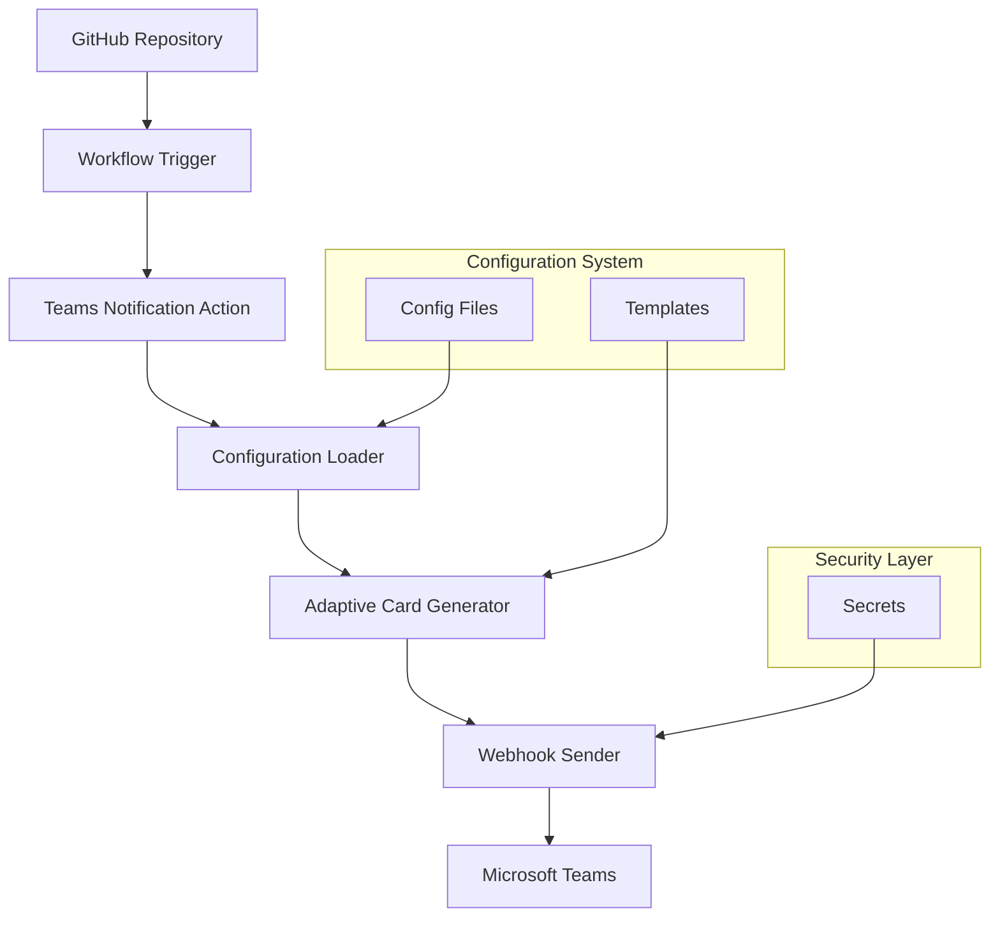

# 🔔 Microsoft Teams Notifications System

Comprehensive Microsoft Teams notification system providing rich, interactive Adaptive Card notifications for all GitHub repository events. This system enables real-time communication and monitoring of your development workflow directly in Microsoft Teams channels.

## 📋 Table of Contents

- [Overview](#-overview)
- [Features](#-features)
- [Getting Started](#-getting-started)
- [Architecture](#-architecture)
- [Configuration](#-configuration)
- [Event Types](#-event-types)
- [Adaptive Cards](#-adaptive-cards)
- [Best Practices](#-best-practices)
- [Troubleshooting](#-troubleshooting)
- [Enterprise Features](#-enterprise-features)

## 🌟 Overview

The Microsoft Teams Notifications System is an enterprise-grade solution that bridges GitHub repository activities with Microsoft Teams channels. It provides:

- **Real-time notifications** for all repository events
- **Rich Adaptive Cards** with interactive elements
- **Intelligent routing** based on event types and priorities
- **Flexible configuration** for different teams and environments
- **Comprehensive error handling** and retry mechanisms
- **Enterprise security** features and compliance

### Key Components

| Component | Purpose | Location |
|-----------|---------|----------|
| **Teams Notification Action** | Core notification engine | `.github/actions/teams-notification/` |
| **Teams Notifications Workflow** | Complete event handling | `.github/workflows/teams-notifications.yml` |
| **Configuration System** | Event-specific settings | `.github/config/teams-notification/` |
| **Example Templates** | Usage demonstrations | `github/workflows/examples/teams-notification/` |

### Platform Configuration

| Input | Description | Default | Options |
|-------|-------------|---------|---------|
| `runs-on` | Runner to use | `ubuntu-latest` | String or JSON array (see below) |

#### Self-Hosted Runner Support

The `runs-on` parameter supports both GitHub-hosted and self-hosted runners:

```yaml
# GitHub-hosted (string)
runs-on: 'ubuntu-latest'

# Self-hosted (JSON array)
runs-on: '["self-hosted", "linux"]'
runs-on: '["self-hosted", "linux", "docker"]'
```

See [Self-Hosted Runner Documentation](../self-hosted-runners.md) for details.

## Features

### 🎨 Rich Visual Experience
- **Adaptive Cards 1.5**: Modern, responsive card layout
- **Dynamic Theming**: Event-specific colors and styling
- **User Avatars**: GitHub user profile pictures
- **Interactive Actions**: Direct links to repositories, workflows, PRs, and issues
- **Custom Branding**: Configurable appearance and styling

### 📊 Comprehensive Event Coverage
- **Workflow Events**: Build success/failure, deployment status, test results
- **Code Review**: PR opened/merged/closed, review requests, approvals
- **Issue Management**: Bug reports, feature requests, assignments, labels
- **Repository Activity**: Pushes, releases, security alerts
- **Custom Events**: Extensible for organization-specific events

### 🎯 Intelligent Routing
- **Priority-based Routing**: Critical events to dedicated channels
- **Environment-specific Channels**: Production, staging, development
- **Team-based Notifications**: Route to relevant team channels
- **Conditional Logic**: Smart notification filtering

### ⚙️ Advanced Configuration
- **YAML Configuration Files**: Centralized, version-controlled settings
- **Template Inheritance**: Reusable configuration patterns
- **Dynamic Content**: Context-aware notification content
- **Flexible Mentions**: User, team, and role-based mentions

### 🛡️ Enterprise Security
- **Webhook Security**: Encrypted webhook URLs in GitHub Secrets
- **Content Sanitization**: Safe handling of user-generated content
- **Audit Logging**: Comprehensive notification delivery tracking
- **Compliance Features**: Regulatory requirement support

## 🚀 Getting Started

### Prerequisites

- **Microsoft Teams**: Access to target Teams channels
- **GitHub Repository**: Repository with Actions enabled
- **Webhook Permissions**: Ability to create incoming webhooks in Teams

### Quick Setup (5 minutes)

#### 1. Create Teams Webhook

1. **Open Microsoft Teams** and navigate to your target channel
2. **Add Incoming Webhook**:
   - Click **⋯** (More options) next to the channel name
   - Select **Connectors**
   - Find **Incoming Webhook** and click **Configure**
   - Provide a name: `GitHub Notifications`
   - Optionally upload a custom image
   - Click **Create**
   - **Copy the webhook URL** (save this securely)

#### 2. Configure GitHub Repository

1. **Add Repository Secret**:
   - Go to your repository **Settings** → **Secrets and variables** → **Actions**
   - Click **New repository secret**
   - Name: `TEAMS_WEBHOOK_URL`
   - Value: Your Teams webhook URL
   - Click **Add secret**

#### 3. Add Notification Workflow

Create `.github/workflows/teams-notifications.yml`:

```yaml
name: 🔔 Teams Notifications

on:
  workflow_run:
    workflows: ["*"]
    types: [completed]
  issues:
    types: [opened, closed]
  pull_request:
    types: [opened, closed]
  push:
    branches: [main, develop]
  release:
    types: [published]

jobs:
  notifications:
    uses: bauer-group/automation-templates/.github/workflows/teams-notifications.yml@main
    secrets:
      TEAMS_WEBHOOK_URL: ${{ secrets.TEAMS_WEBHOOK_URL }}
```

#### 4. Test the Setup

1. **Trigger a test event** (e.g., create an issue, push code, or manually run a workflow)
2. **Check your Teams channel** for the notification
3. **Verify the card appearance** and interactive elements work

## 🏗️ Architecture

### System Components



### Notification Flow

1. **Event Trigger**: GitHub repository event occurs
2. **Workflow Activation**: Teams notification workflow starts
3. **Configuration Loading**: Event-specific settings loaded
4. **Content Generation**: Adaptive card payload created
5. **Webhook Delivery**: Notification sent to Teams
6. **Retry Logic**: Automatic retry on failure
7. **Status Reporting**: Delivery confirmation logged

### Data Flow

```yaml
GitHub Event → Workflow → Action → Config → Card → Teams
     ↓           ↓        ↓       ↓      ↓      ↓
   Metadata   Processing Logic  Theme  JSON  Display
```

## ⚙️ Configuration

### Configuration File Structure

Configuration files are stored in `.github/config/teams-notification/` using YAML format:

```yaml
# Basic structure
extends: "default"              # Inherit from base configuration

theme:
  colors:                       # Event-specific theme colors
    workflow_success: "28a745"  # Success green
    workflow_failure: "dc3545"  # Error red
    default: "0078d4"           # Microsoft blue

features:                       # Feature toggles
  mentions: true               # Enable @mentions
  facts: true                  # Show facts section
  actions: true                # Display action buttons
  timestamps: true             # Include timestamps
  avatars: true                # Show user avatars
  retry: true                  # Enable retry logic

notifications:                  # Delivery settings
  timeout: 30                  # Request timeout (seconds)
  retry_count: 3               # Number of retry attempts
  retry_delay: 2               # Delay between retries (seconds)

content:                        # Content limits
  title_max_length: 100        # Maximum title length
  summary_max_length: 500      # Maximum summary length
  details_max_length: 1000     # Maximum details length

mentions:                       # Default mentions by event type
  workflow_failure:
    - "devops-team"
    - "maintainers"
  issue_opened:
    - "maintainers"

formatting:                     # Text formatting options
  use_emojis: true             # Include emojis
  bold_titles: true            # Bold formatting for titles
  code_formatting: true        # Code block formatting
```

### Available Configuration Files

| Configuration | Purpose | Use Case |
|--------------|---------|----------|
| **default.yml** | Base configuration | General notifications |
| **success.yml** | Success events | Workflow success, deployments |
| **failure.yml** | Critical failures | Build failures, security issues |
| **issue.yml** | Issue management | Bug reports, feature requests |
| **pull-request.yml** | Code review | PR workflow, code changes |
| **push.yml** | Code commits | Repository activity |
| **release.yml** | Version releases | Product releases, tags |
| **test.yml** | Testing/debugging | Development and testing |

### Environment-Specific Configuration

```yaml
# .github/config/teams-notification/production.yml
extends: "default"

theme:
  colors:
    default: "dc3545"           # Red for production alerts

mentions:
  workflow_failure:
    - "on-call-team"
    - "site-reliability"
    - "team-leads"

notifications:
  retry_count: 5               # More retries for critical environment
  timeout: 45                  # Longer timeout

content:
  title_max_length: 150       # Longer titles for production context
```

## 📝 Event Types

### Workflow Events

| Event | Trigger | Description | Default Color |
|-------|---------|-------------|---------------|
| `workflow_success` | Workflow completes successfully | Build success, tests pass | 🟢 Green |
| `workflow_failure` | Workflow fails | Build errors, test failures | 🔴 Red |
| `workflow_started` | Workflow begins | CI/CD pipeline starts | 🔵 Blue |

### Issue Events

| Event | Trigger | Description | Default Color |
|-------|---------|-------------|---------------|
| `issue_opened` | New issue created | Bug reports, feature requests | 🟠 Orange |
| `issue_closed` | Issue closed | Issue resolved | 🟢 Green |
| `issue_assigned` | Issue assigned to user | Task assignment | 🔵 Blue |
| `issue_labeled` | Label added to issue | Issue categorization | 🟣 Purple |

### Pull Request Events

| Event | Trigger | Description | Default Color |
|-------|---------|-------------|---------------|
| `pr_opened` | PR created | Code review requested | 🔵 Blue |
| `pr_closed` | PR closed without merge | PR rejected or withdrawn | ⚫ Gray |
| `pr_merged` | PR merged | Code integrated | 🟢 Green |
| `pr_ready_for_review` | Draft PR ready | Review requested | 🟦 Light Blue |

### Repository Events

| Event | Trigger | Description | Default Color |
|-------|---------|-------------|---------------|
| `push` | Code pushed | Commits added | 🟣 Purple |
| `release` | Release published | Version release | 🟦 Teal |
| `security_alert` | Security vulnerability | Security issue found | 🔴 Red |

### Custom Events

You can create custom event types for organization-specific needs:

```yaml
- name: 🔔 Custom Event
  uses: bauer-group/automation-templates/.github/actions/teams-notification@main
  with:
    webhook-url: ${{ secrets.TEAMS_WEBHOOK_URL }}
    event-type: 'custom_deployment'
    title: 'Custom Deployment Event'
    theme-color: '20c997'
    config-file: 'custom'
```

## 🎨 Adaptive Cards

### Card Structure

Teams notifications use Microsoft Adaptive Cards 1.5 for rich, interactive experiences:

#### Header Section
- **User Avatar**: GitHub profile picture
- **Title**: Event-specific title with emoji
- **Repository Link**: Clickable repository name
- **Status Indicator**: Color-coded status

#### Content Section
- **Summary**: Brief event description
- **Details**: Expanded information (collapsible)
- **Formatting**: Markdown support, code blocks, lists

#### Facts Section
- **Metadata**: Key-value pairs
- **Dynamic Content**: Event-specific information
- **Custom Facts**: Configurable additional data

#### Actions Section
- **Repository**: Link to repository
- **Workflow**: Link to workflow run
- **Issue/PR**: Direct links to related items
- **Custom Actions**: Configurable buttons

### Card Examples

#### Success Notification Card

```json
{
  "type": "AdaptiveCard",
  "version": "1.5",
  "body": [
    {
      "type": "Container",
      "style": "good",
      "items": [
        {
          "type": "ColumnSet",
          "columns": [
            {
              "type": "Column",
              "items": [
                {
                  "type": "Image",
                  "url": "https://github.com/user.png",
                  "style": "Person",
                  "size": "Small"
                }
              ]
            },
            {
              "type": "Column",
              "items": [
                {
                  "type": "TextBlock",
                  "text": "✅ **Build Successful**",
                  "weight": "Bolder",
                  "size": "Medium"
                },
                {
                  "type": "TextBlock",
                  "text": "[my-repository](https://github.com/org/repo)",
                  "color": "Accent"
                }
              ]
            }
          ]
        }
      ]
    },
    {
      "type": "TextBlock",
      "text": "All tests passed successfully! 🎉"
    },
    {
      "type": "FactSet",
      "facts": [
        {"title": "Duration:", "value": "2m 34s"},
        {"title": "Branch:", "value": "main"},
        {"title": "Commit:", "value": "abc12345"}
      ]
    }
  ],
  "actions": [
    {
      "type": "Action.OpenUrl",
      "title": "📂 Repository",
      "url": "https://github.com/org/repo"
    },
    {
      "type": "Action.OpenUrl",
      "title": "🔄 Workflow",
      "url": "https://github.com/org/repo/actions/runs/123"
    }
  ]
}
```

### Theming and Styling

#### Color Schemes

| Scheme | Primary | Success | Warning | Error | Info |
|--------|---------|---------|---------|--------|------|
| **Default** | #0078d4 | #28a745 | #ffc107 | #dc3545 | #17a2b8 |
| **Dark** | #106ebe | #1e7e34 | #e0a800 | #bd2130 | #138496 |
| **Light** | #318ce7 | #34ce57 | #ffe135 | #e35d6a | #20c5e5 |

#### Custom Styling

```yaml
# Custom theme configuration
theme:
  colors:
    workflow_success: "20c997"    # Custom teal
    workflow_failure: "e83e8c"    # Custom pink
    custom_event: "6f42c1"        # Custom purple
    
card:
  style: "emphasis"               # Card style: default, emphasis, good, attention, warning
  width: "Full"                   # Card width: Auto, Stretch, Full
```

## 💡 Best Practices

### 1. Webhook Management

#### Security
```yaml
# ✅ Good: Use GitHub Secrets
webhook-url: ${{ secrets.TEAMS_WEBHOOK_URL }}

# ❌ Bad: Hardcode webhook URLs
webhook-url: "https://outlook.office.com/webhook/..."
```

#### Multiple Environments
```yaml
# Environment-specific webhooks
webhook-url: ${{ 
  github.ref == 'refs/heads/main' && secrets.TEAMS_WEBHOOK_PROD ||
  github.ref == 'refs/heads/develop' && secrets.TEAMS_WEBHOOK_DEV ||
  secrets.TEAMS_WEBHOOK_DEFAULT 
}}
```

### 2. Content Optimization

#### Titles
```yaml
# ✅ Good: Descriptive and concise
title: '🚀 Production Deployment - v2.1.0'

# ❌ Bad: Too generic
title: 'Workflow completed'
```

#### Summaries
```yaml
# ✅ Good: Informative summary
summary: |
  Deployment to production completed successfully in 8m 23s
  🎯 Zero downtime deployment
  📊 All health checks passed

# ❌ Bad: Redundant with title
summary: 'Deployment completed'
```

### 3. Mention Strategy

#### Strategic Mentions
```yaml
# ✅ Good: Contextual mentions
mention-users: ${{ 
  contains(github.event.issue.labels.*.name, 'critical') && 'security-team,on-call' ||
  contains(github.event.issue.labels.*.name, 'bug') && 'qa-team' ||
  ''
}}

# ❌ Bad: Always mention everyone
mention-users: 'everyone,all-developers,managers,stakeholders'
```

### 4. Performance Optimization

#### Efficient Notifications
```yaml
# ✅ Good: Conditional notifications
- name: 🔔 Critical Issues Only
  if: contains(github.event.issue.labels.*.name, 'critical')
  uses: bauer-group/automation-templates/.github/actions/teams-notification@main

# ❌ Bad: Notify on every event
- name: 🔔 All Events
  uses: bauer-group/automation-templates/.github/actions/teams-notification@main
```

#### Content Size Management
```yaml
# Configuration for content limits
content:
  title_max_length: 100          # Prevent oversized titles
  summary_max_length: 500        # Manageable summary size
  details_max_length: 1000       # Limit detailed content
```

### 5. Error Handling

#### Robust Notifications
```yaml
- name: 🔔 Robust Notification
  id: notify
  continue-on-error: true
  uses: bauer-group/automation-templates/.github/actions/teams-notification@main
  with:
    enable-retry: 'true'
    retry-count: '3'
    timeout: '45'

- name: 📋 Fallback on Failure
  if: steps.notify.outcome == 'failure'
  run: |
    echo "Primary notification failed, using fallback"
    # Alternative notification method
```

### 6. Configuration Management

#### Organized Configurations
```
.github/config/teams-notification/
├── default.yml          # Base configuration
├── environments/
│   ├── production.yml   # Production settings
│   ├── staging.yml      # Staging settings
│   └── development.yml  # Development settings
├── teams/
│   ├── frontend.yml     # Frontend team settings
│   ├── backend.yml      # Backend team settings
│   └── devops.yml       # DevOps team settings
└── events/
    ├── security.yml     # Security event settings
    ├── releases.yml     # Release event settings
    └── monitoring.yml   # Monitoring settings
```

## 🔧 Troubleshooting

### Common Issues

#### 1. Webhook Connectivity

**Symptoms:**
- `HTTP timeout` errors
- `Network unreachable` messages
- Notifications not appearing in Teams

**Diagnostics:**
```yaml
- name: 🔍 Test Webhook Connectivity
  run: |
    echo "Testing webhook connectivity..."
    curl -X POST \
      -H "Content-Type: application/json" \
      -d '{"text": "Connectivity test"}' \
      "${{ secrets.TEAMS_WEBHOOK_URL }}" \
      --max-time 30 \
      -v
```

**Solutions:**
1. **Verify Webhook URL**: Ensure the URL is complete and accessible
2. **Check Network**: Verify GitHub Actions can reach Microsoft Teams
3. **Increase Timeout**: Use longer timeout values for slow networks
4. **Enable Retry**: Use retry mechanism for transient failures

#### 2. Card Payload Issues

**Symptoms:**
- `HTTP 400 Bad Request`
- Malformed card display
- Missing content sections

**Diagnostics:**
```yaml
- name: 🧪 Debug Card Payload
  uses: bauer-group/automation-templates/.github/actions/teams-notification@main
  with:
    webhook-url: ${{ secrets.TEAMS_WEBHOOK_URL }}
    event-type: 'test'
    title: 'Debug Test'
    config-file: 'test'
```

**Solutions:**
1. **Validate JSON**: Ensure custom facts are valid JSON
2. **Check Content Length**: Verify content doesn't exceed limits
3. **Test Incrementally**: Start with minimal content and add complexity
4. **Use Configuration Files**: Leverage pre-tested configurations

#### 3. Mention Problems

**Symptoms:**
- Mentions not working
- Unknown user errors
- Notification spam

**Solutions:**
1. **Verify User/Team Names**: Ensure mentioned entities exist in Teams
2. **Check Permissions**: Verify webhook has permission to mention
3. **Use Conditional Mentions**: Apply mentions strategically
4. **Test with Known Users**: Start with confirmed user/team names

#### 4. Performance Issues

**Symptoms:**
- Slow notification delivery
- Timeout errors
- High failure rates

**Solutions:**
1. **Optimize Content Size**: Reduce payload size
2. **Implement Retry Logic**: Use exponential backoff
3. **Monitor Performance**: Track delivery times
4. **Load Balance**: Use multiple webhooks for high volume

### Debug Mode

Enable comprehensive debugging:

```yaml
- name: 🧪 Debug Notification
  uses: bauer-group/automation-templates/.github/actions/teams-notification@main
  with:
    webhook-url: ${{ secrets.TEAMS_WEBHOOK_URL }}
    event-type: 'test'
    title: 'Debug Mode Test'
    summary: 'Testing with full debugging enabled'
    details: |
      **Debug Information:**
      - Event: ${{ github.event_name }}
      - Actor: ${{ github.actor }}
      - Repository: ${{ github.repository }}
      - Workflow: ${{ github.workflow }}
      - Run ID: ${{ github.run_id }}
    custom-facts: |
      [
        {"title": "Event Name", "value": "${{ github.event_name }}"},
        {"title": "Repository", "value": "${{ github.repository }}"},
        {"title": "Actor", "value": "${{ github.actor }}"},
        {"title": "Workflow", "value": "${{ github.workflow }}"},
        {"title": "Run ID", "value": "${{ github.run_id }}"}
      ]
    config-file: 'test'
    enable-retry: 'true'
    retry-count: '1'
    timeout: '60'
```

## 🏢 Enterprise Features

### Security and Compliance

#### Webhook Security
- **Encrypted Storage**: All webhook URLs stored in GitHub Secrets
- **Access Control**: Repository-level access management
- **Audit Trail**: Complete notification delivery logging
- **Content Sanitization**: Safe handling of user-generated content

#### Compliance Features
- **Data Retention**: Configurable log retention periods
- **Content Filtering**: Automatic PII and sensitive data detection
- **Access Logging**: Comprehensive access and usage tracking
- **Regulatory Support**: GDPR, SOX, HIPAA compliance features

### Multi-Tenant Support

#### Organization-Wide Deployment
```yaml
# Organization workflow template
name: Org-Wide Teams Notifications

on:
  workflow_call:
    inputs:
      tenant-id:
        required: true
        type: string
    secrets:
      TEAMS_WEBHOOK_URL:
        required: true

jobs:
  notify:
    runs-on: ubuntu-latest
    steps:
      - name: 🔔 Tenant Notification
        uses: bauer-group/automation-templates/.github/actions/teams-notification@main
        with:
          webhook-url: ${{ secrets.TEAMS_WEBHOOK_URL }}
          event-type: 'workflow_success'
          title: '[${{ inputs.tenant-id }}] Build Success'
          config-file: 'tenant-${{ inputs.tenant-id }}'
```

#### Team-Specific Configurations
```yaml
# .github/config/teams-notification/team-frontend.yml
extends: "default"

theme:
  colors:
    default: "17a2b8"           # Team brand color

mentions:
  workflow_failure:
    - "frontend-team"
    - "ui-lead"
  pr_opened:
    - "frontend-reviewers"

content:
  title_prefix: "[Frontend]"    # Team identifier
```

### Monitoring and Analytics

#### Performance Metrics
- **Delivery Time**: Average notification delivery duration
- **Success Rate**: Percentage of successful deliveries
- **Failure Analysis**: Categorized failure reasons
- **Volume Tracking**: Notification frequency and patterns

#### Dashboard Integration
```yaml
- name: 📊 Performance Metrics
  uses: bauer-group/automation-templates/.github/actions/teams-notification@main
  with:
    webhook-url: ${{ secrets.TEAMS_WEBHOOK_URL }}
    event-type: 'workflow_success'
    title: 'Performance Dashboard Update'
    custom-facts: |
      [
        {"title": "Delivery Time", "value": "${{ steps.notify.outputs.delivery-time }}ms"},
        {"title": "Success Rate", "value": "${{ steps.metrics.outputs.success-rate }}%"},
        {"title": "Volume", "value": "${{ steps.metrics.outputs.daily-volume }}"}
      ]
    config-file: 'monitoring'
```

### Integration Ecosystem

#### Microsoft 365 Integration
- **Power Automate**: Workflow automation triggers
- **SharePoint**: Document management integration
- **Outlook**: Email notification fallbacks
- **Power BI**: Analytics and reporting

#### Third-Party Integrations
- **Slack**: Cross-platform notification sync
- **ServiceNow**: Incident management integration
- **Jira**: Issue tracking synchronization
- **PagerDuty**: Alert escalation support

---

## 📚 Additional Resources

### Documentation
- [Action Reference](../../.github/actions/teams-notification/README.md) - Detailed action documentation
- [Configuration Guide](../../.github/config/teams-notification/README.md) - Configuration reference
- [Examples Collection](../../github/workflows/examples/teams-notification/) - Usage examples

### Microsoft Documentation
- [Microsoft Teams Webhooks](https://docs.microsoft.com/en-us/microsoftteams/platform/webhooks-and-connectors/how-to/add-incoming-webhook)
- [Adaptive Cards](https://docs.microsoft.com/en-us/adaptive-cards/)
- [Teams App Development](https://docs.microsoft.com/en-us/microsoftteams/platform/)

### GitHub Documentation
- [GitHub Actions](https://docs.github.com/en/actions)
- [Workflow Syntax](https://docs.github.com/en/actions/using-workflows/workflow-syntax-for-github-actions)
- [Repository Secrets](https://docs.github.com/en/actions/security-guides/encrypted-secrets)

---

*This documentation is maintained by the BAUER GROUP IT team. For questions, support, or contributions, please open an issue in the [repository](https://github.com/bauer-group/automation-templates).*